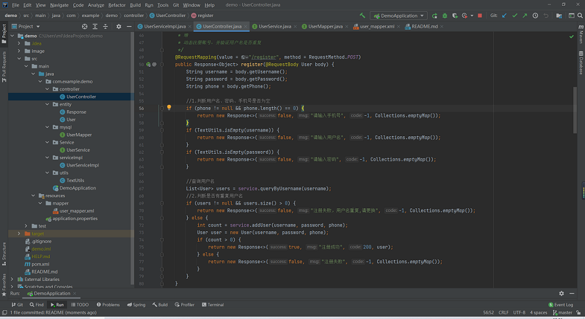

## 实战Java接口学习之路

## 需要用到mysql  8.0.22 winx64安装配置方法图文 教程地址：http://note.youdao.com/noteshare?id=bc87cf96e09dbeaeba6ca094591da455
## MyBatis-Plus官网  https://baomidou.com/#/
## 参考学习博客，在此感谢：https://blog.csdn.net/weixin_44135121/category_9285585.html

## 框架说明
## pom.xml 注解框架、数据库框架、分页框架

## 地址说明
## 本地电脑访问 http://localhost:8080/ 或者 http://127.0.0.1:8080/  
## 同一个网，外部访问需要获取IPV4端口  比如http://192.168.43.148:8080/

## 接口说明
## getUserInfo          测试接口，不需要数据库可访问 http://localhost:8080/getUserInfo
## addUser              注册接口
## login                登录接口
## deleteUser           删除单条数据
## queryUser            查询所有用户
## updateUser           修改用户信息
## getUserPageList      分页，模糊查询

      

  
   

